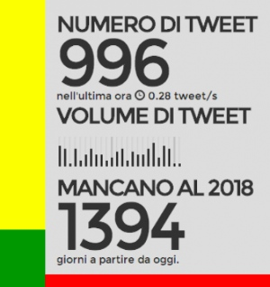

## #Trenzi - Monitorare il Governo del Fare



Trenzi usa la Twitter Streaming API e genera una bellissima infografica in realtime

Trenzi uses the Twitter Streaming API and generates a beautiful realtime infographic

## Requirements and configuration
- Install `MeteorJS` (e.g 0.8.0) and `Meteorite`.

- Create your `settings.json` with your [Twitter API keys](https://apps.twitter.com/app/new), look at `settings.json.example`.

## Run

Open a terminal and type:
```
meteor --settings settings.json
```

## Seed example data (optional)

Open a web browser console and type `Meteor.call('fillData')`, run it multiple times to load more data.

## Deploy (optional)

Configure your production server or:
```
meteor deploy your-trenzi.meteor.com  --settings settings.json
```

## License

Copyright (C) 2014 Luigi Maselli - http://grigio.org - MIT Licence